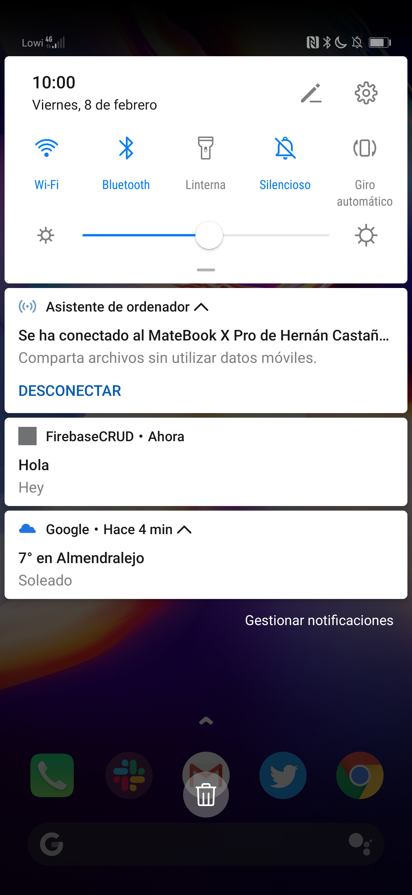
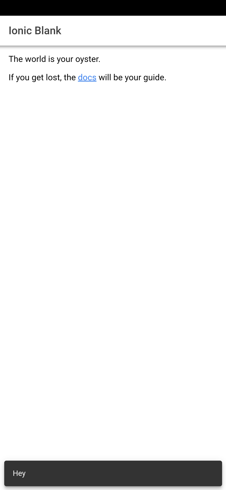

Firebase Notification Template
======================

Firebase Notification template is an application based on Ionic, specifically version 4,
which will allow us to receive notifications from Firebase on our devices, no matter whether
we have an Android, iOS or PWA application.

# Features

The app displays a notification on our device if the application is on background, or closed. This notification
can include a title, as well as a description/message.

The app also displays a toast with the description/message if the user has the application opened, so we avoid
uneedded notifications that can disturb the user, as supposedly he should be able to read it.

  
  

# Development Environment

The app is written entirely in Ionic and uses Angular.

Before launching the application, it is required to `npm install` to install all the required Node Modules
and Plugins for the project.

Once this step is followed, you should use the next command `npm install @angular/fire firebase --save` to install required Angular Firebase Modules.

To build the app, use the `ionic cordova run android` command for the Android version, or
`ionic cordova run ios` command for iOS.

If we want to compile the production version, we just need to add `--prod` at the end of above commands.

## Firebase

The app makes considerable use of the following Firebase components:

- [Firebase Cloud Functions](https://firebase.google.com/docs/functions/)
allowed us to run backend code. The reservations feature heavily depended on Cloud
Functions working in conjuction with Firestore.
- [Firebase Cloud Messaging](https://firebase.google.com/docs/cloud-messaging/concept-options)
let us inform the app about changes to conference data on our server.

## Firebase configuration
To be finished.

## Ionic

We made an early decision to use Ionic because Jose wants us to.

Ionic is currently on its version number 4, recently released in 2019. This platform allows
you to develop multi-platform applications, supporting currently Android, iOS and PWA.

Ionic makes use of Angular for most of its projects, as well as our. For more information and
usage of it please have a look at
[Ionic](https://ionicframework.com/).